# Demo transformation evidence — September 28

See the [running progress](../../demo-transformation-progress.md) for scope,
findings, decisions, and remaining work. This is an incremental verification
record, not a full-app or sustained-ingestion qualification.

## Changes verified

- Explore → real search → select evidence → start fresh analysis → Capabilities
  → Explore: the analysis completes and remains available. Explore → Live →
  Explore also preserves the answer, query, source filter, and selected clip.
- Capabilities: healthy model services no longer imply ready history. The page
  shows `Unavailable now` and the actual admission reason. Search/evidence require
  indexed and retained media on the same source; live/alerts require source checks.
- Monitoring: unit tests distinguish pending/error from an empty rule catalog;
  real settled state remains two enabled rules and two sources with rules.
- Live: `Review source` now opens focused source intelligence, rather than Events.
  Unknown source analysis is not given a healthy/no-action-needed message.

## Checks

| Check | Evidence / scope |
| --- | --- |
| Page identity | Vision Intelligence at `http://10.88.9.12:7777`, workspace query updates |
| Meaningful content / framework overlay | Relevant workspaces rendered without a framework overlay |
| Console | Known failures: four unavailable simulator preview URLs returned 500; live playback request failed. No claim of an error-free full session |
| Screenshots | Saved below; desktop Home/zone/playback/readiness and mobile readiness inspected |
| Real interaction | Search, playback, fresh visual briefing, source Q&A, preserved investigation, source handoff |
| Responsive scope | Capabilities at 390×844; document width and viewport both 390 px. This does not qualify all mobile flows |
| Automated tests | 43 tests passed across six affected suites, in two scoped runs |
| Static checks | App TypeScript check and `git diff --check` passed |
| Runtime after checks | 31 core roles, no reported failures, 49.98 GiB available; 48 GiB guard preserved |

Browser plugin was unavailable; used available Playwright MCP tools against the
already-running source-mounted development server. No service restart, model
budget change, or ingestion activation was performed.

## Timing samples

| Interaction | Result | Measurement |
| --- | --- | --- |
| Source-scoped semantic search | 224 ms | Click → rendered matching result; one ten-second recording |
| Exact clip playback | 301 ms | Click → video currentTime > 0 and playing; readyState 4 |
| Fresh visual inspection + synthesis | 25,862.4 ms | Browser HTTP resource duration; result rendered |
| Second fresh inspection + synthesis | 34,381.5 ms | Browser HTTP resource duration; completed while navigating |

These are individual observations, not a latency distribution. The fresh AI
briefing violates the intended pacing and remains an open task.

## Commands

From `services/ui`:

```sh
npm test --workspace=nv-metropolis-bp-vss-ui -- --runInBand --testPathPatterns='VisionIntelligenceApp.test.tsx|CapabilitiesWorkspace.test.tsx|useVisionStreams.test.ts|InvestigateWorkspace.test.tsx'
npm test --workspace=nv-metropolis-bp-vss-ui -- --runInBand --testPathPatterns='OperationsWorkspace.test.tsx|AlertRulesWorkspace.test.tsx'
npm run typecheck --workspace=nv-metropolis-bp-vss-ui
git diff --check
```

## Screenshots

Before: Home emphasizes paused sources and system state.

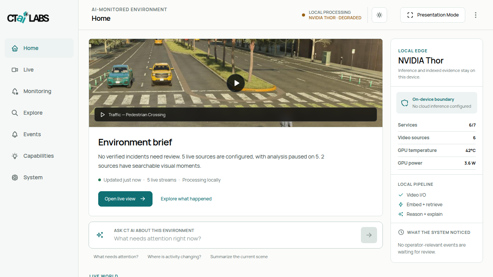

Before: unavailable simulator source permitted drawing over a blank zone editor.

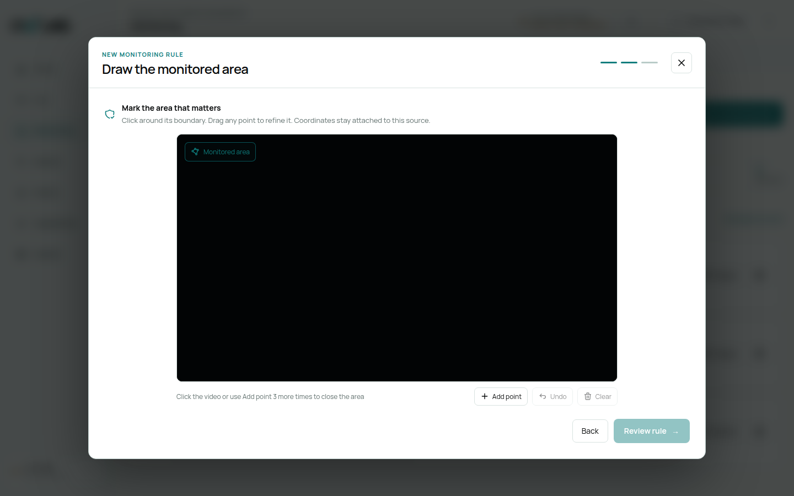

After: drawing/review wait for a usable frame; an unavailable source offers retry
or a return to source selection. No rule was activated during verification.

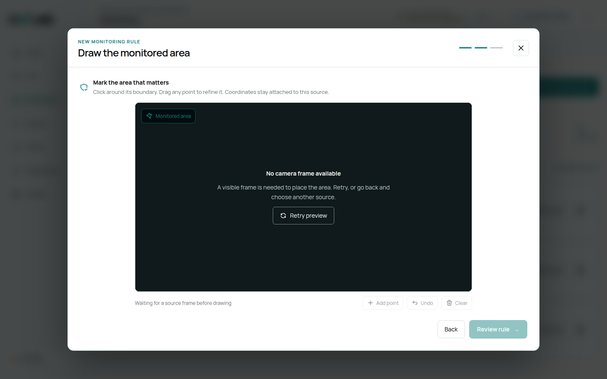

After choosing the traffic source: a decoded retained frame permits drawing.
This demonstrates preview recovery, not working live video. Screenshots precede
the final wording explaining that the preview may use a retained frame.

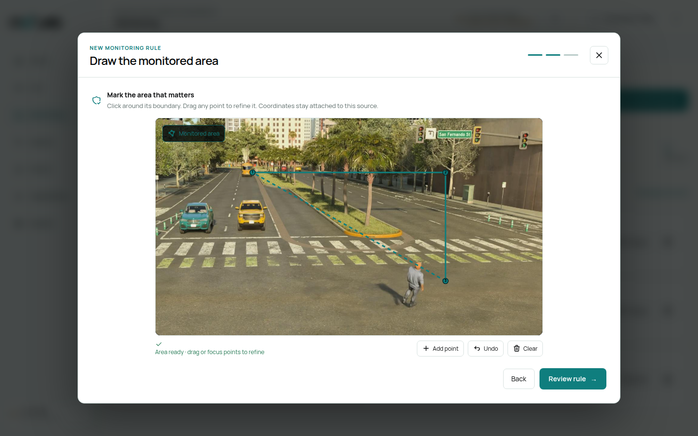

Working baseline: real recorded evidence playback.

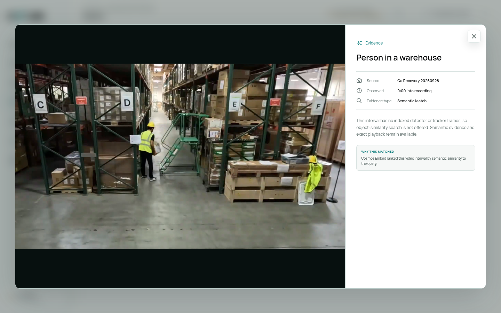

After: history readiness reflects actual workload admission.

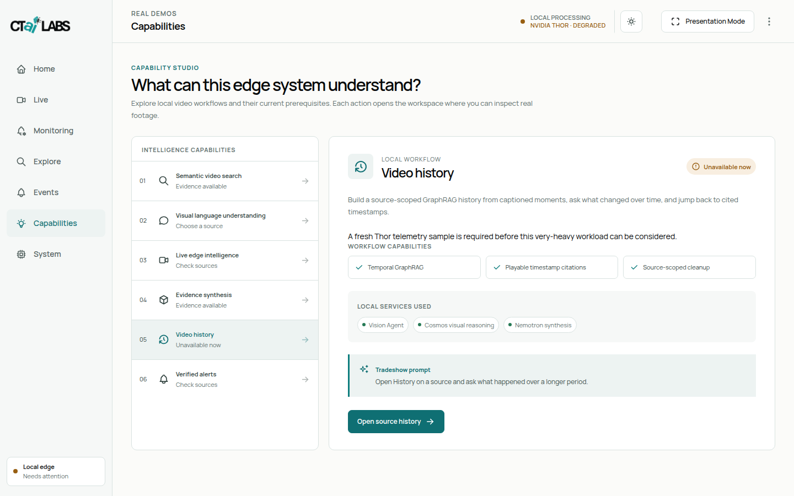

After: completed real analysis retained across workspace navigation.

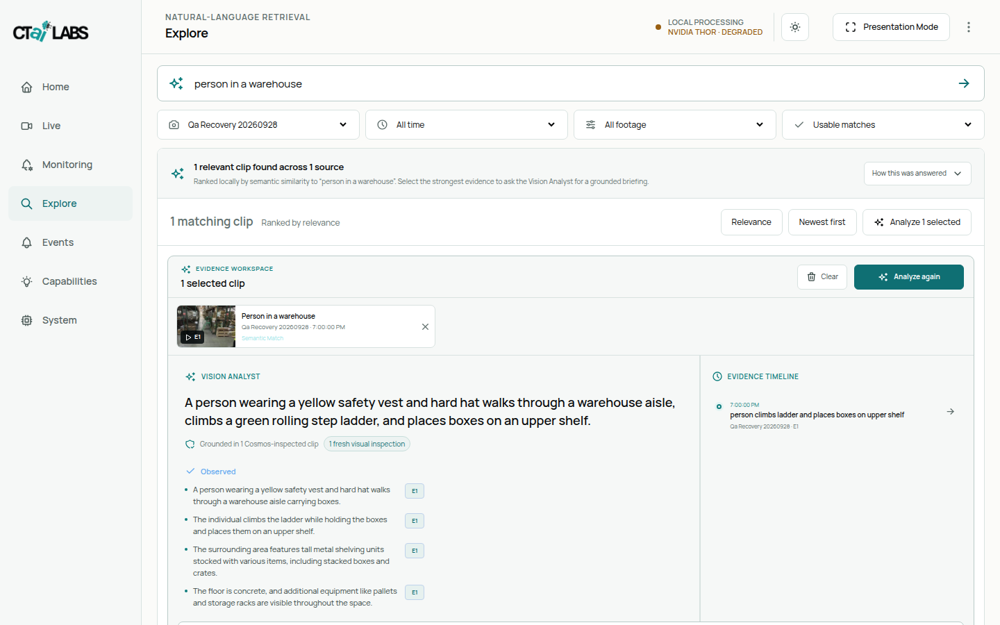

Mobile: capability page at 390 px, including the persistent bottom navigation.

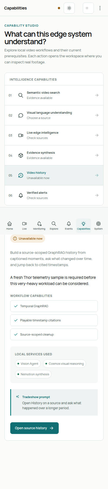

After: direct single-clip visual answer, with recording offsets consistent in the
tray and timeline. This run took 21.002 seconds in visual inspection and 0.1 ms
in response assembly; the earlier optimized run took 13.102 seconds. The removed
synthesis stage had cost 8.793 seconds in the instrumented baseline. These are
individual real requests, not a latency distribution. Answer verbosity and
duplicate presentation remain visible defects to address.

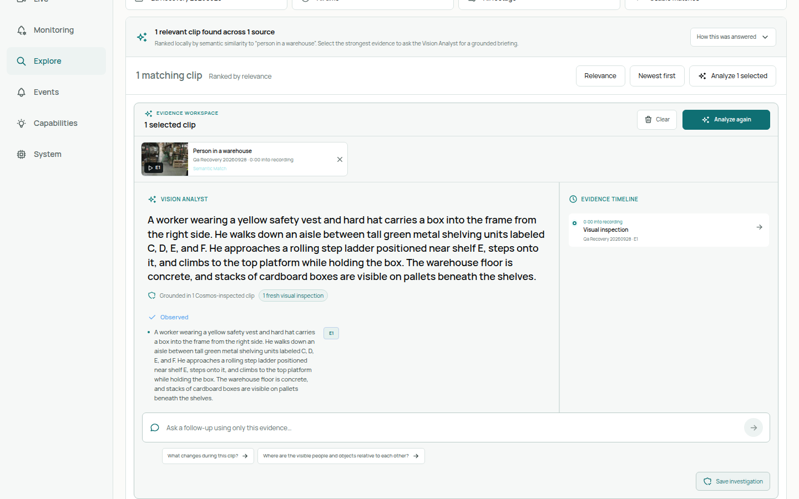

Home after redesign: actual footage, source-scoped search, and a clear evidence
journey. Real source labels and paused states are preserved. See the
[concept comparison and verification](home-design.md) for scope and deviations.

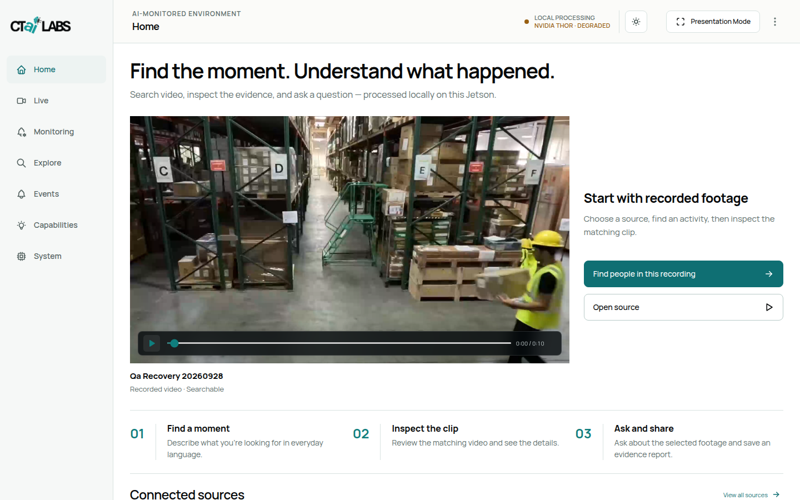

Mobile Home, 390×844: no horizontal overflow; the remaining journey and source
list are below the first viewport.

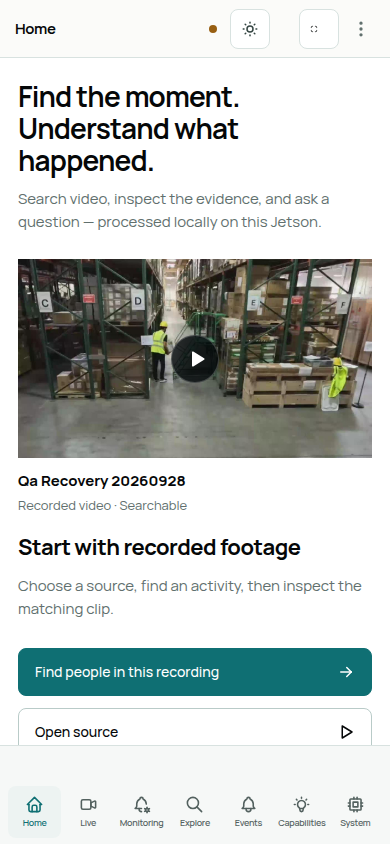

Evidence answer after removing the duplicate observation. This screenshot
precedes a small spacing correction between the citation and provenance line.

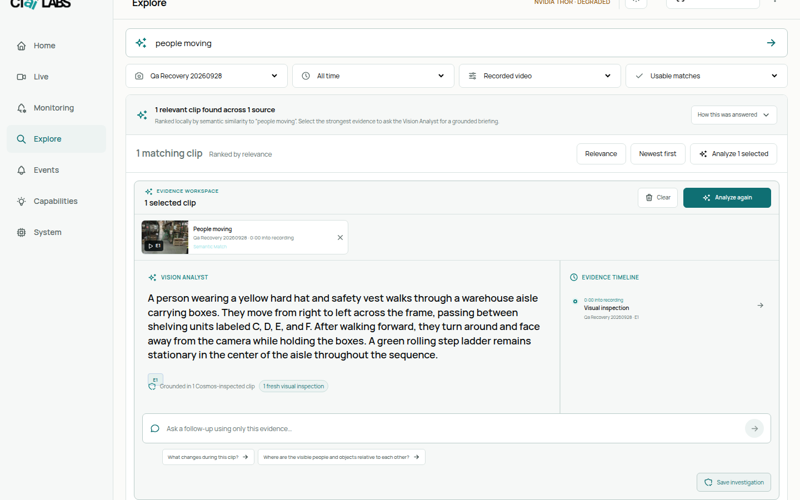

Saved report preserves the recording-relative label. Report-level repetition
and the empty interpretation section remain known presentation issues.

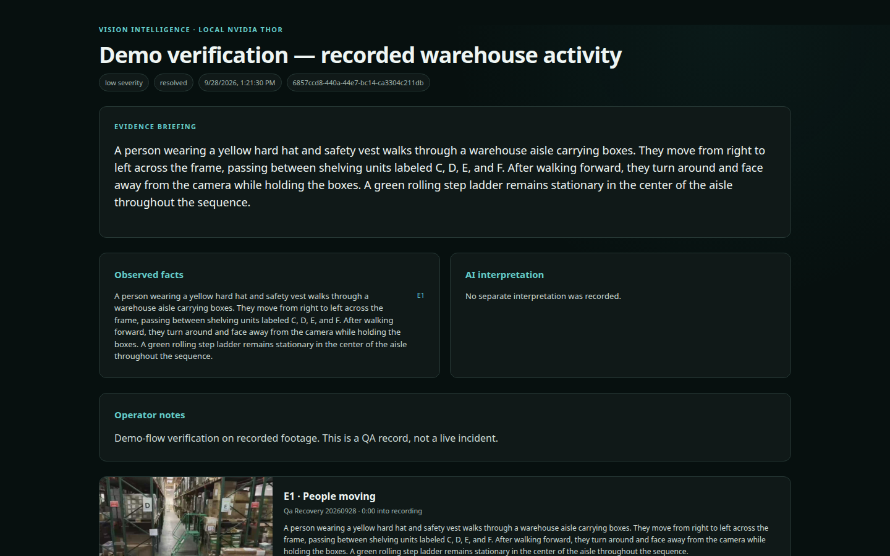

After repairing recording-root access and timestamp origin: a retained five-second
clip plays from the report. Both ffprobe and browser duration report five seconds.
The cache is bounded and evictable; this is not permanent offline archival.

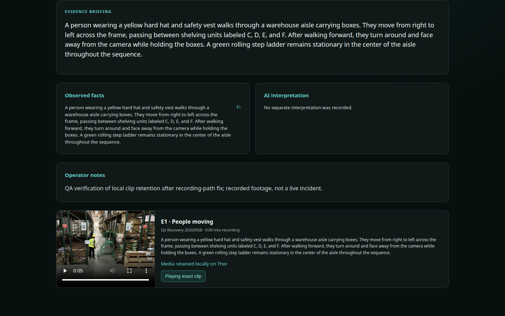

Report after removing duplicate answer text and empty sections. Distinct claims
are still shown when present; the single-clip answer keeps its playable citation.

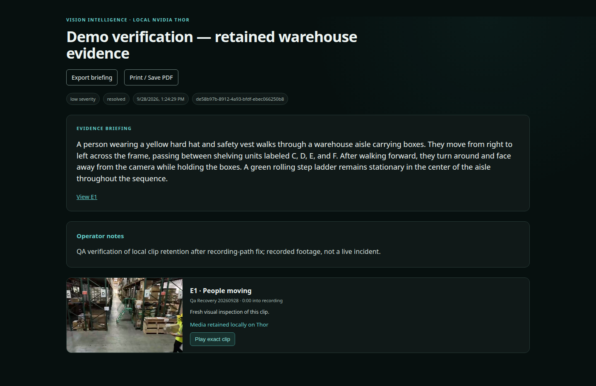

[Exported HTML briefing](exported-briefing.html) was opened as a local file with
browser networking disabled. Local E1 citation worked; after restoring networking,
the absolute Jetson evidence link opened the report and played five seconds.
Video itself is not embedded in the export.

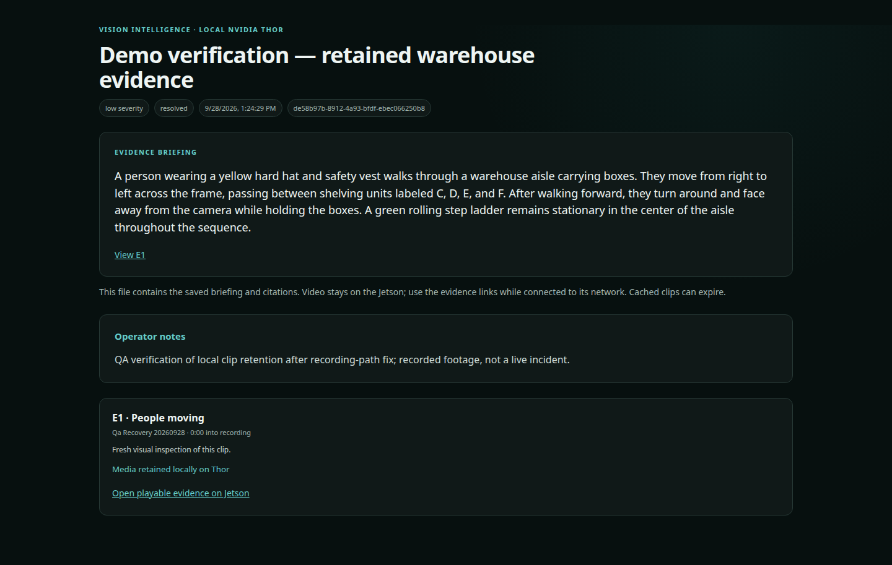

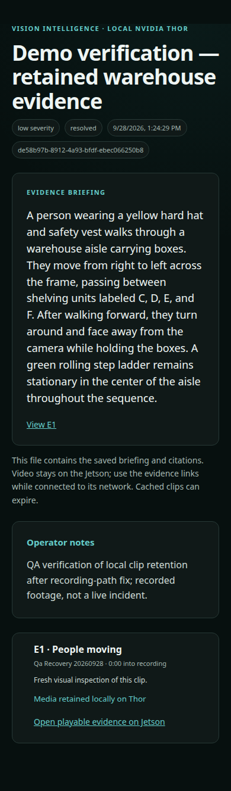

Print-media styling checked in the browser; no physical print/PDF pagination
qualification is claimed.

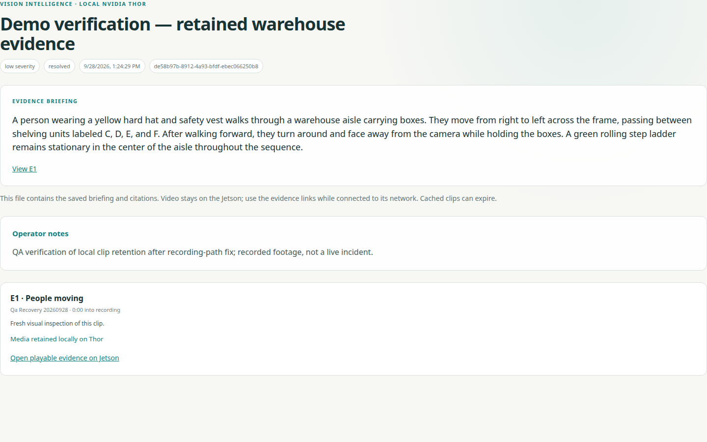

## Source preview integrity follow-up

System → Sources now shows explicit unavailable labels for four simulator
previews while two retained thumbnails decode. [Screenshot](source-preview-fallbacks.png).
Both same-origin picture routing and rejection of proxy fallback SVGs are covered
by scoped tests; the video canvas cannot declare those illustrations real frames.
12 app tests and 24 package tests passed; both TypeScript checks passed. Camera
onboarding form was inspected and cancelled without submitting. Green source-type
badges in this inventory remain a follow-up; they are not connection-health proof.

## Events entry follow-up

Empty Events now explains how monitored conditions become reviewable evidence and
offers verified navigation to Live and Monitoring. Three existing incident tests
and TypeScript pass. [Desktop](events-next-actions.png) and
[390px mobile](events-next-actions-mobile.png); no horizontal overflow measured.
A real triggered-incident walkthrough remains unqualified.

## Inference temperature correction and runtime recovery

See [temperature-fix-evaluation.md](temperature-fix-evaluation.md) for the deployed
parameter fix, focused tests, interrupted broader test, restored core runtime and
three recorded response checks. This supersedes earlier runtime snapshots, not
their historical measurements. General visual accuracy remains an open finding.
